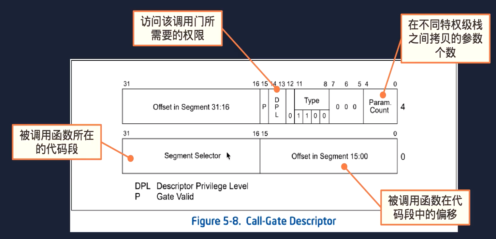
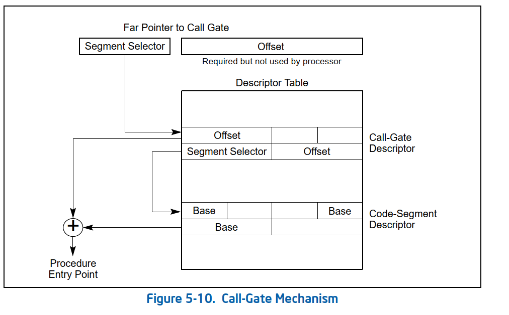
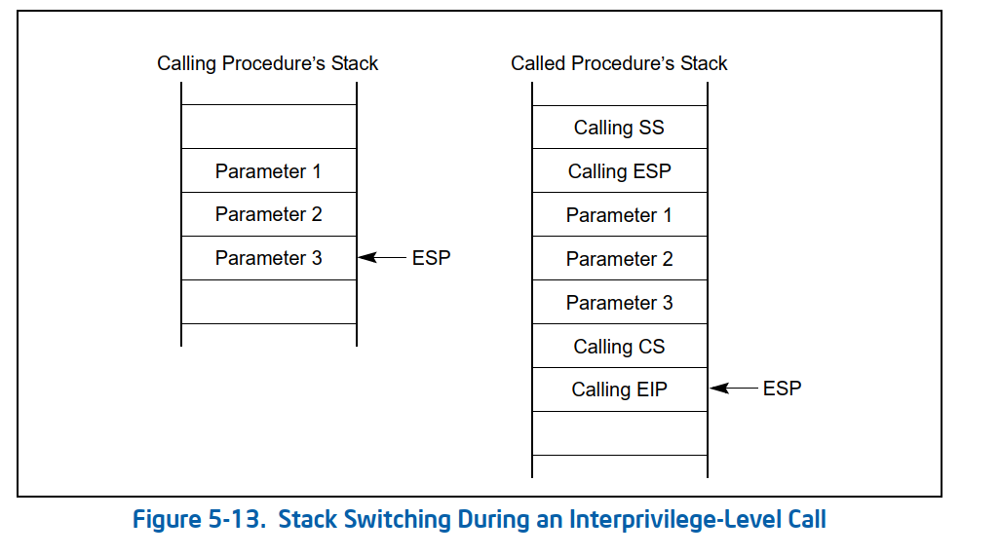
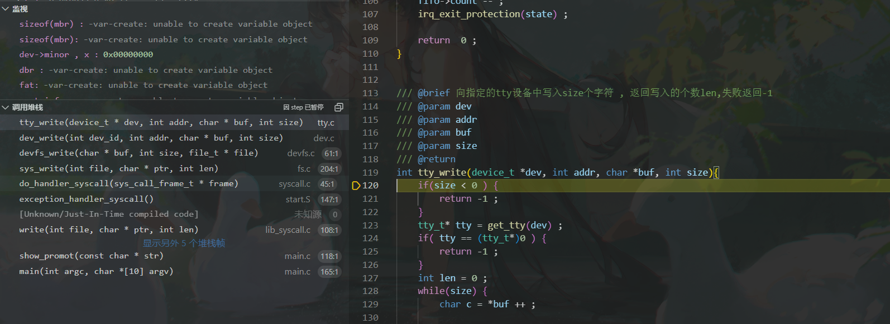
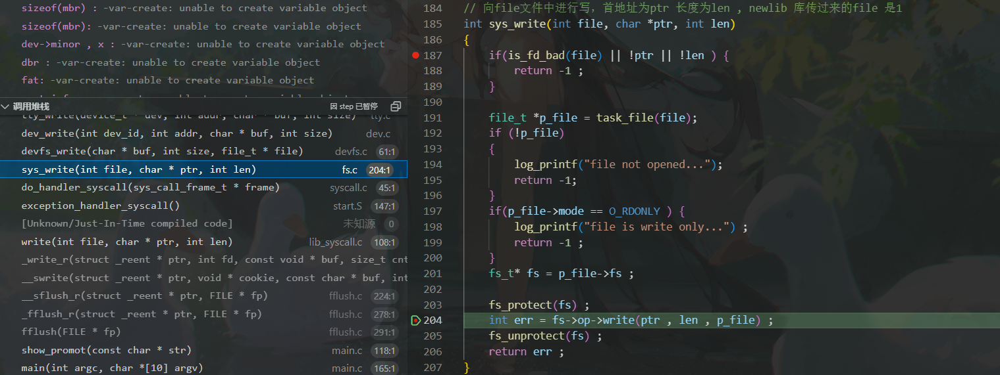
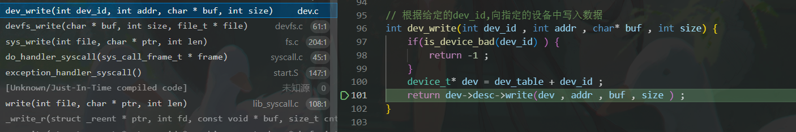
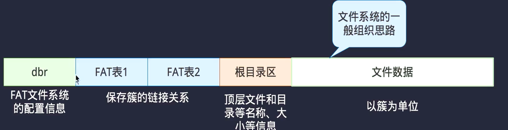

##系统调用的两种方式
###在GDT表中建立系统调用门
**在GDT表中建立调用门用于系统调用,让第一个用户级进程能够调用内核代码:**
调用门描述符:

调用门工作流程：
+ 执行`call`调用门选择子:$0
+ 取出被调用函数所在的代码选择子及其偏移
+ 计算被调用函数的入口地址


**注意调用门描述符里面存储的是段选择子**


**调用门整体调用链:**
```

// first_task 的代码
#include "applib/lib_syscall.h"
int first_task_main(void)
{
    int pid = getpid() ; 


    for(;;)
    {       
        print_msg("the process pid is:%d" , pid) ;  
        msleep(1000) ; 
    }   
}
在上述特权级为三的应用进程调用操作系统提供的外部接口调用系统调用函数sys_sleep(1000) , 


// applib/lib_syscall.h 代码

static inline void msleep(int ms ){
    if(ms <= 0 ) return ; 

    syscall_args_t args ; 
    args.id = SYS_sleep ;
    args.arg0 = ms ; 

    sys_call(&args) ;  
}

typedef struct  _syscall_args_t {
    int id ; // 系统函数调用号
    int arg0 ; 
    int arg1 ; 
    int arg2 ;
    int arg3 ; 

} syscall_args_t ; 

static inline int sys_call(syscall_args_t* args){
    
    uint32_t addr[] = { 0  , SELECTOR_SYSCALL | 0 } ; 
    int ret ; 
    __asm__ __volatile__ (
        "push %[arg3]\n\t"
        "push %[arg2]\n\t"
        "push %[arg1]\n\t"
        "push %[arg0]\n\t"
        "push %[id]\n\t"

        "lcalll *(%[a])\n\t"
        : "=a"(ret) 
        :[a]"r"(addr) , [id]"r"(args->id) , [arg0]"r"(args->arg0) , 
            [arg1]"r"(args->arg1) , [arg2]"r"(args->arg2) , [arg3]"r"(args->arg3) 
        : 
    ) ; 

    return ret ; 
} 


```
在lib_syscall.h 头文件中的所有提供的外部接口最终都会调用到`sys_call`函数 , 在其中使用gcc内联汇编，使用lcalll *(%[a])指令执行远程过程调用，目标地址为addr指向的地址 ， 而 addr 代表的就是在GDT表中设置的系统调用门的选择子(第一个0表示的是偏移量，不过我们这里并没有用到，实际使用的偏移量是位于调用门字段里的offset,可以参考第一个图片)

设置系统调用门的源码:
```
  // 在dgt表中设置调用门描述符，调用内核指定的exception_handler_syscall函数
    gate_dest_set(
        (gate_desc_t*)(gdt_table + (SELECTOR_SYSCALL >> 3 )) , KERNEL_SELECTOR_CS  , 
        (uint32_t)exception_handler_syscall , 
        GATE_P_PRESENT | GATE_DPL3 | GATE_TYPE_SYSCALL | SYSCALL_COUNT 
    ) ; 
```
在设置其权限的时候为`GATE_DPL3` , 如果想要成功访问调用门所代表的数据，需要满足`DPL >= max(CPL , RPL)` , 所以设置其特权级为3，以便在应用进程下能成功调用系统函数。

再来看一下`exception_handler_syscall`函数
```
	.global exception_handler_syscall
	.extern do_handler_syscall
exception_handler_syscall:

	pushal
	push %ds
	push %es
	push %fs
	push %gs
	pushf 

	mov %esp , %eax 
	push %eax 
	call do_handler_syscall 
	
	add $4 , %esp 

	popf
	pop %gs
	pop %fs
	pop %es
	pop %ds
	popal

	retf $(5 * 4)   
# retf 表示远返回 , 为了在内核栈弹出之前在lib_syscall下的sys_call函数压入的5个参数需要将esp指针向上调整20哥个字节
```
在之前执行`sys_call`函数的时候，使用的是`first_task`进程的`task_struct`结构中的`tss`结构中的`esp` 指向的特权级为3的栈空间，在通过调用门执行到`exception_handler_syscall` 中间会自动进行一个栈空间的切换，切换到特权级为0的栈空间:


图示左侧是特权级为3的栈，右侧为特权级为0的栈，在硬件自动切换栈空间的时候，会先将栈空间的地址和指针进行入栈，之后将在`sys_call`压入左侧栈空间的三个参数拷贝到内核栈空间，最后再压入`cs EIP` 起到一个保护现场的作用。
注意上述代码，为了实现对`do_handler_syscall`传参的操作，先将栈顶指针入栈，当做`do_gandler_syscall`的参数，**也就是syscall_frame_t结构体的的起始地址，从而能够很轻易的把之前的硬件自动压入的一些参数取出**，展示一下`syscall_frame_t`的结构：
```
// 注: 开头不是eip的原因是因为我们在 exception_handler_syscall 下手动压入了一些参数，保护之前的现场。
typedef struct _sys_call_frame_t {
    int eflags ; 
    int gs , fs , es , ds ; 
    uint32_t edi , esi , ebp , dummy , ebx , edx , ecx , eax ; 
    int eip , cs ; 
    int func_id , arg0 , arg1 , arg2  , arg3 ; 
    int esp , ss ;  
} sys_call_frame_t ; 
```
**这个传参操作是十分的优秀的。**


###当我们在C语言函数中使用gcc内联汇编进行手动压栈的时候，是否需要进行手动出栈??(未解决):
```
static inline int sys_call(syscall_args_t* args){
    
    uint32_t addr[] = { 0  , SELECTOR_SYSCALL | 0 } ; 
    int ret ; 
    __asm__ __volatile__ (   // 这里使用汇编进行手动压栈的话不用进行手动出栈的吗？
        "push %[arg3]\n\t"
        "push %[arg2]\n\t"
        "push %[arg1]\n\t"
        "push %[arg0]\n\t"
        "push %[id]\n\t"

        "lcalll *(%[a])\n\t"
        : "=a"(ret) 
        :[a]"r"(addr) , [id]"r"(args->id) , [arg0]"r"(args->arg0) , 
            [arg1]"r"(args->arg1) , [arg2]"r"(args->arg2) , [arg3]"r"(args->arg3) 
        : 
    ) ; 

    return ret ; 
} 


// 反汇编生成的汇编代码:

static inline int sys_call(syscall_args_t* args){
80000010:	55                   	push   %ebp
80000011:	89 e5                	mov    %esp,%ebp
80000013:	57                   	push   %edi
80000014:	56                   	push   %esi
80000015:	53                   	push   %ebx
80000016:	83 ec 10             	sub    $0x10,%esp
    
    uint32_t addr[] = { 0  , SELECTOR_SYSCALL | 0 } ; 
80000019:	c7 45 e8 00 00 00 00 	movl   $0x0,-0x18(%ebp)
80000020:	c7 45 ec 18 00 00 00 	movl   $0x18,-0x14(%ebp)
        "push %[arg0]\n\t"
        "push %[id]\n\t"

        "lcalll *(%[a])\n\t"
        : "=a"(ret) 
        :[a]"r"(addr) , [id]"r"(args->id) , [arg0]"r"(args->arg0) , 
80000027:	8b 45 08             	mov    0x8(%ebp),%eax
8000002a:	8b 10                	mov    (%eax),%edx
8000002c:	8b 45 08             	mov    0x8(%ebp),%eax
8000002f:	8b 48 04             	mov    0x4(%eax),%ecx
            [arg1]"r"(args->arg1) , [arg2]"r"(args->arg2) , [arg3]"r"(args->arg3) 
80000032:	8b 45 08             	mov    0x8(%ebp),%eax
80000035:	8b 58 08             	mov    0x8(%eax),%ebx
80000038:	8b 45 08             	mov    0x8(%ebp),%eax
8000003b:	8b 70 0c             	mov    0xc(%eax),%esi
8000003e:	8b 45 08             	mov    0x8(%ebp),%eax
80000041:	8b 78 10             	mov    0x10(%eax),%edi
    __asm__ __volatile__ (
80000044:	8d 45 e8             	lea    -0x18(%ebp),%eax
80000047:	57                   	push   %edi
80000048:	56                   	push   %esi
80000049:	53                   	push   %ebx
8000004a:	51                   	push   %ecx
8000004b:	52                   	push   %edx
8000004c:	ff 18                	lcall  *(%eax)
8000004e:	89 45 f0             	mov    %eax,-0x10(%ebp)
        : 
    ) ; 
    
    return ret ; 
80000051:	8b 45 f0             	mov    -0x10(%ebp),%eax
} 
80000054:	83 c4 10             	add    $0x10,%esp
80000057:	5b                   	pop    %ebx
80000058:	5e                   	pop    %esi
80000059:	5f                   	pop    %edi
8000005a:	5d                   	pop    %ebp
8000005b:	c3                   	ret  
```
**答: 不需要，因为在从内核栈返回的时候，我们已经对`esp`进行了调整:**
```
exception_handler_syscall:

	pushal
	push %ds
	push %es
	push %fs
	push %gs
	pushf 

	mov %esp , %eax 
	push %eax 
	call do_handler_syscall 
	
	add $4 , %esp 

	popf
	pop %gs
	pop %fs
	pop %es
	pop %ds
	popal

	retf $(5 * 4)   
```
`最后一行汇编，在返回到用户栈的时候，会自动将esp的值向高低地址移动20个字节，对应着参数在用户栈的出栈`


设计思想: 为了消除硬件和软件之间的交互所带来的操作系统的代码的可读性的降低，同时体现出linux系统中的**一切皆文件的思想**，在本操作系统，为了实现这个效果，设立一个**设备层** ，`操作系统所有需要和硬件进行交互的代码`都会统一调用**设备层中所有硬件设备提前注册好的接口函数**，从而在代码上实现一个**多态**的效果，c语言也能实现多态的效果我是很惊讶的。下面具体来看一下这个手法。

**值的一提的是，这种手法的好处是，后期维护的时候可以将操作系统的的代码很好的保持，如果后序有新的硬件设备需要接入操作系统，只需要在设备层进行一个注册，就能实现和设备的交互，从而进行了一个解耦** 

**设备层**在代码上的体现就是一个`dev.c`编译单元和其头文件`dev.h` 其余的硬件设备比如tty终端体现为`tty.c`和`tty.h`, 硬盘抽象为`disk.c`和`disk.h` 同时磁盘上的文件系统也被抽象为`fatfs.c`和`fatfs.h`


以向`tty`中写"Hello world" 字符为例，来观察操作系统如何通过**设备层**间接和硬件的编译单元进行交互。

总览一下整个调用过程:


我们在main函数中调用printf("Hello world") ; 其是`newlib`库中封装好的库函数，**在newlib**库中其会默认认为操作系统提供了一个write(int file , char* ptr , int len ) 的系统调用，(实际上我们确实设置了),并调用该函数，
write() 函数调用 exception_handler_syscall() 继续调用 sys_wirte(int file , char* ptr , int len ) , 此函数就是真正的操作系统内核代码:



根据传入的文件描述符file找到对应的 p_file 指针, (注:在之前初始化的时候，已经对文件进行了open操作) , p_file 代表了一个文件，在linux下有着一切皆文件的思想，所以在这里，这个p_file可以代表的是一个硬盘上的文件，可以是一个tty0, 并且在 file_t 结构体中，存在一个 fs_t* 的指针，**fs_t表示的是各种系统的抽象**, 所以该字段表示当前文件的具体所属的文件系统，这里列出fs_t结构体的详细结构:
```
typedef struct _fs_t {
    fs_op_t * op ; // 回调函数的表
    char mount_point[FS_MOUNT_SIZE] ; 
    fs_type_t type ; 
    void*  data ; 
    int dev_id ;   // 设备的id , 识别磁盘上的某个分区
    
    list_node_t node ; 
    mutex_t*  mutex ; 
    
    union {
        fat_t fat_data ; 
    } ; 

}fs_t ; 

// fs_op_t 的结构定义如下:

typedef struct _fs_op_t {
    int (*mount)(struct  _fs_t* fs , int major , int minor ) ; 
    int (*unmount)(struct _fs_t* fs ) ; 

    int (*open)(struct _fs_t* fs , const char* path , file_t* file ); 
    int (*read)(char* buf , int size , file_t* file ) ; 
    int (*write)(char* buf , int size , file_t* file ) ; 
    void (*close)(file_t* file ) ; 
    int (*seek)(file_t* file , uint32_t offset , int dir ) ; 
    int (*stat)(file_t* file , struct stat* st ) ; // 取出file文件的信息放入到st结构体中
} fs_op_t ; 

```

在上图中通过在sys_write() 调用提前注册好的调用设备管理系统中的 devfs_write() 函数，devfs_write() 函数又调用了
dev_write(int dev_id , int addr , char* buf , int size ) , 在dev_write函数中通过指定的`dev_id` , 调用相应的dev->desc->write(dev , addr , buf , size ) 



给出device_t 结构和其中一些字段的结构
```
typedef struct _device_t {
    struct _dev_desc_t* desc ;  // 设备的特性

    int mode ; // 用来控制模式
    int minor ; // 次设备号
    void* data ; // 存放相关参数
    int open_count ; // 设备打开次数
}device_t ; 

//struct  _dev_desc_t 表示访问当前设备的函数接口，都是一些提前注册好的函数指针。
// 描述某一类的特性
typedef struct _dev_desc_t {
    char name[DEV_NAME_SIZE] ; // 设备名称
    int major ;  // 主设备类型号


    int (*open)(device_t* dev ) ;  // open 函数，不同的函数逻辑不同，所以这里是函数指针
    int(*read)(device_t* dev , int addr , char* buf , int size ) ; 
    int(*write)(device_t* dev , int addr , char* buf , int size ) ; 
    int(*control)(device_t* dev , int cmd , int arg0 , int agr1 ) ; 
    int(*close)(device_t* dev) ; 

} dev_desc_t ; 
```

最终，调用到tty_write函数，从而向屏幕上打印出了`Hello world`。 


###FAT16文件的大致组成:



**实现`ctrl + L`快捷键快速对显示器进行一个清屏，并且`ctrl + L`不会显示到屏幕上**
