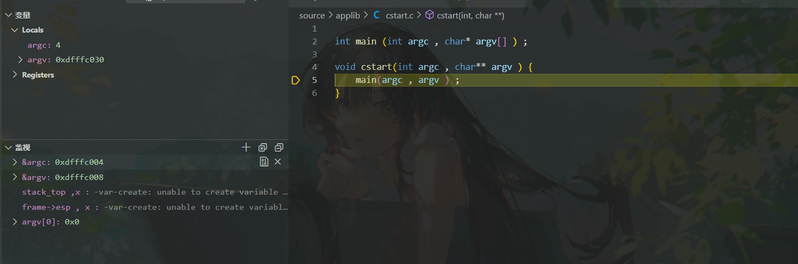
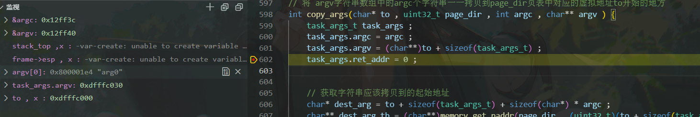
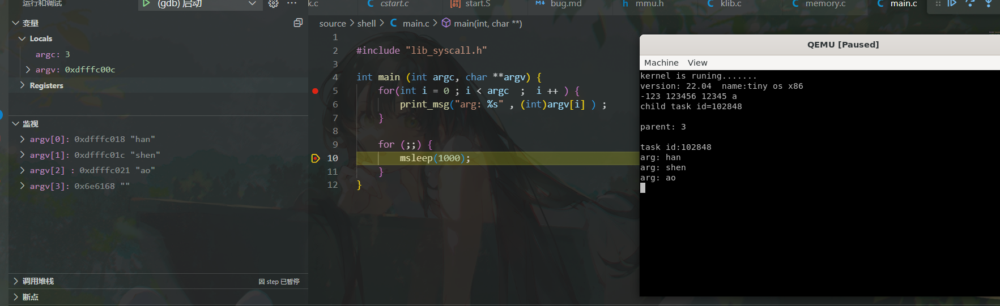

```
-exec x /20xb 0x80000000
0x80000000 <first_task_entry>:	0x66	0x8c	0xd0	0x8e	0xd8	0x8e	0xc0	0x8e
0x80000008 <first_task_entry+8>:	0xe0	0x8e	0xe8	0xe9	0x00	0x00	0x00	0x00
0x80000010 <first_task_main>:	0x55	0x89	0xe5	0x83
```
在执行kernel_memcpy()的时候，拷贝first_task 进程的内存到虚拟地址0x80000000 的时候，在编写kernel_memcpy()的时候，功能函数为
```
void kernel_memcpy(void *dest, void *src, uint32_t size)
{
    if (!dest || !src || !size)
        return;
    uint8_t *d = (uint8_t *)dest;
    uint8_t *s = (uint8_t *)src;

    while ( (size-- ) && *s ) 
    {
        *d++ = *s++;
    }
}
```

**注意上述代码中的判断条件的问题，** ， 上述内存二进制视图是我们实际复制到0x80000000 的数据，其中存在一些字节的值为`0x00` 这就造成了代码移动出现了问题 , 在此强调kernel_memcpy()函数的作用:**将源地址指定size个字节复制到目的地址src去，无论源地址是否结束**


####由于父进程和子进程共享栈而造成的异常:
部分sys_fork()函数的代码
```
    task_t* parent_task = task_current() ; 

    task_t* child_task = alloc_task() ; 
    if(child_task == (task_t*)0 ) {
        goto fork_failed ; 
    }

    // 获取在内核栈中压入的一些参数的设置。
    sys_call_frame_t* frame =(sys_call_frame_t*) ( parent_task->tss.esp0 - sizeof(sys_call_frame_t) )  ; 

    int err = task_init(child_task , parent_task->name , 0 , frame->eip , frame->esp + sizeof(uint32_t) * SYSCALL_COUNT ) ;
    if(err < 0 ) {
        goto fork_failed ; 
    } 
```
在初始化子进程的task_t结构的时候，使用父进程的栈空间作为子进程的栈空间，未考虑到**父进程在退出sys_fork()之后，会对栈空间之中的内容进行出栈，破坏了栈空间**，从而导致异常:
```
void do_handler_page_fault(exception_frame_t * frame) {
        ....
}
```
解决方案: 让子进程的虚拟空间中的内容和父进程的相同，但物理空间中的代码重新拷贝一份放到合适的地方


###在实现execve函数调用后执行指定的shell.elf文件失败,无法正常获取传入到`main`函数的参数



图片中的argv的值应该是`0xdfffc00c`但现在明显不正确:


定位到设置task_args.argv的值的地方，图中的`to=0xdfffc000`, 给出`task_args_t` 的结构体为：


```
写法1: task_args.argv = (char **)(to + sizeof(task_args_t));

写法2: task_args.argv = (char**)to + sizeof(task_args_t) ; 

```
上述两者的主要区别是什么? , `to`的类型在强制转换为(char**)之前为`char*` , 
在写法1当中, to + sizeof(task_args_t) 之后的值为`0xdfffc00c` 因为`to`的类型为`char*` 每一跳的大小是一个`char`的大小，而需要进行sizeof(task_args_t) 跳跃。
在写法2当中，`to`先被转换为(char**) , 再进行跳跃，此时的一跳的大小就是`char*` 也就是4字节，所以在写法二中，结果就为`0xdfffc030` , 这个错误的结果了。之前以为是结构体对齐的问题，但仔细观察一下`task_args_t`的结构体，发现其结构其实是天然对齐的，不会出现字节空洞:
```
typedef struct _task_args_t {
    
    uint32_t ret_addr ; 
    uint32_t argc ; 
    char** argv ; 
} task_args_t ; 
```
成功实现借助用户栈向shell程序进行传参:


