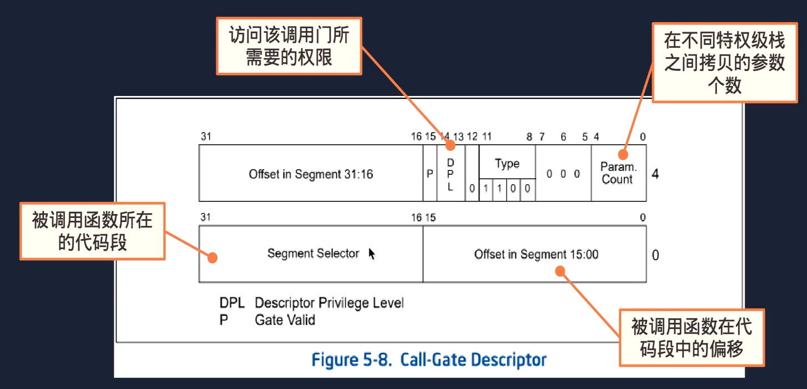

##系统调用的两种方式
###在GDT表中建立系统调用门
**在GDT表中建立调用门用于系统调用,让第一个用户级进程能够调用内核代码:**
调用门描述符:

调用门工作流程：
+ 执行`call`调用门选择子:$0
+ 取出被调用函数所在的代码选择子及其偏移
+ 计算被调用函数的入口地址


**注意调用门描述符里面存储的是段选择子**


**调用门整体调用链:**
```

// first_task 的代码
#include "applib/lib_syscall.h"
int first_task_main(void)
{
    int pid = getpid() ; 


    for(;;)
    {       
        print_msg("the process pid is:%d" , pid) ;  
        msleep(1000) ; 
    }   
}
在上述特权级为三的应用进程调用操作系统提供的外部接口调用系统调用函数sys_sleep(1000) , 


// applib/lib_syscall.h 代码

static inline void msleep(int ms ){
    if(ms <= 0 ) return ; 

    syscall_args_t args ; 
    args.id = SYS_sleep ;
    args.arg0 = ms ; 

    sys_call(&args) ;  
}

typedef struct  _syscall_args_t {
    int id ; // 系统函数调用号
    int arg0 ; 
    int arg1 ; 
    int arg2 ;
    int arg3 ; 

} syscall_args_t ; 

static inline int sys_call(syscall_args_t* args){
    
    uint32_t addr[] = { 0  , SELECTOR_SYSCALL | 0 } ; 
    int ret ; 
    __asm__ __volatile__ (
        "push %[arg3]\n\t"
        "push %[arg2]\n\t"
        "push %[arg1]\n\t"
        "push %[arg0]\n\t"
        "push %[id]\n\t"

        "lcalll *(%[a])\n\t"
        : "=a"(ret) 
        :[a]"r"(addr) , [id]"r"(args->id) , [arg0]"r"(args->arg0) , 
            [arg1]"r"(args->arg1) , [arg2]"r"(args->arg2) , [arg3]"r"(args->arg3) 
        : 
    ) ; 

    return ret ; 
} 


```
在lib_syscall.h 头文件中的所有提供的外部接口最终都会调用到`sys_call`函数 , 在其中使用gcc内联汇编，使用lcalll *(%[a])指令执行远程过程调用，目标地址为addr指向的地址 ， 而 addr 代表的就是在GDT表中设置的系统调用门的选择子(第一个0表示的是偏移量，不过我们这里并没有用到，实际使用的偏移量是位于调用门字段里的offset,可以参考第一个图片)

设置系统调用门的源码:
```
  // 在dgt表中设置调用门描述符，调用内核指定的exception_handler_syscall函数
    gate_dest_set(
        (gate_desc_t*)(gdt_table + (SELECTOR_SYSCALL >> 3 )) , KERNEL_SELECTOR_CS  , 
        (uint32_t)exception_handler_syscall , 
        GATE_P_PRESENT | GATE_DPL3 | GATE_TYPE_SYSCALL | SYSCALL_COUNT 
    ) ; 
```
在设置其权限的时候为`GATE_DPL3` , 如果想要成功访问调用门所代表的数据，需要满足`DPL >= max(CPL , RPL)` , 所以设置其特权级为3，以便在应用进程下能成功调用系统函数。

再来看一下`exception_handler_syscall`函数
```
	.global exception_handler_syscall
	.extern do_handler_syscall
exception_handler_syscall:

	pushal
	push %ds
	push %es
	push %fs
	push %gs
	pushf 

	mov %esp , %eax 
	push %eax 
	call do_handler_syscall 
	
	add $4 , %esp 

	popf
	pop %gs
	pop %fs
	pop %es
	pop %ds
	popal

	retf $(5 * 4)   
# retf 表示远返回 , 为了在内核栈弹出之前在lib_syscall下的sys_call函数压入的5个参数需要将esp指针向上调整20哥个字节
```
在之前执行`sys_call`函数的时候，使用的是`first_task`进程的`task_struct`结构中的`tss`结构中的`esp` 指向的特权级为3的栈空间，在通过调用门执行到`exception_handler_syscall` 中间会自动进行一个栈空间的切换，切换到特权级为0的栈空间:


图示左侧是特权级为3的栈，右侧为特权级为0的栈，在硬件自动切换栈空间的时候，会先将栈空间的地址和指针进行入栈，之后将在`sys_call`压入左侧栈空间的三个参数拷贝到内核栈空间，最后再压入`cs EIP` 起到一个保护现场的作用。
注意上述代码，为了实现对`do_handler_syscall`传参的操作，先将栈顶指针入栈，当做`do_gandler_syscall`的参数，**也就是syscall_frame_t结构体的的起始地址，从而能够很轻易的把之前的硬件自动压入的一些参数取出**，展示一下`syscall_frame_t`的结构：
```
// 注: 开头不是eip的原因是因为我们在 exception_handler_syscall 下手动压入了一些参数，保护之前的现场。
typedef struct _sys_call_frame_t {
    int eflags ; 
    int gs , fs , es , ds ; 
    uint32_t edi , esi , ebp , dummy , ebx , edx , ecx , eax ; 
    int eip , cs ; 
    int func_id , arg0 , arg1 , arg2  , arg3 ; 
    int esp , ss ;  
} sys_call_frame_t ; 
```
**这个传参操作是十分的优秀的。**


