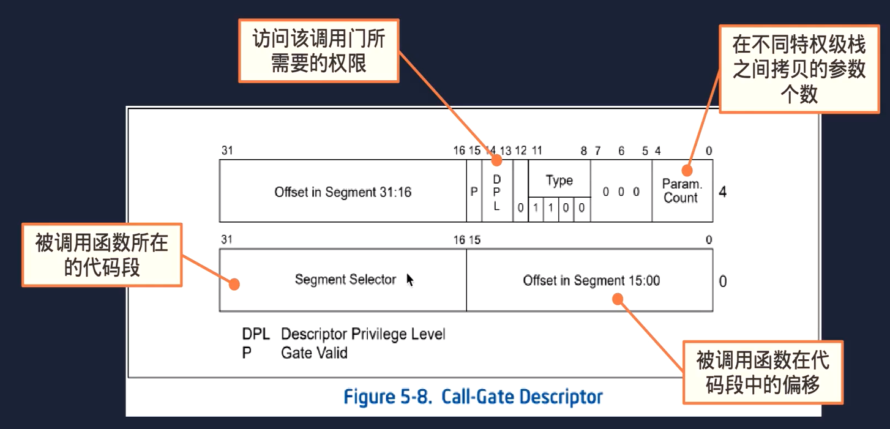

**在GDT表中建立调用门用于系统调用,让第一个用户级进程能够调用内核代码:**
调用门描述符:

调用门工作流程：
+ 执行`call`调用门选择子:$0
+ 取出被调用函数所在的代码选择子及其偏移
+ 计算被调用函数的入口地址
**注意调用门描述符里面存储的是段选择子**

**调用门整体调用链:**

```
所有应用进程中的系统调用都通过 lcalll 指令跳转的调用门指定的内核代码段中的exception_handler_syscall处理函数
```


